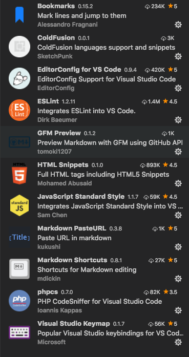
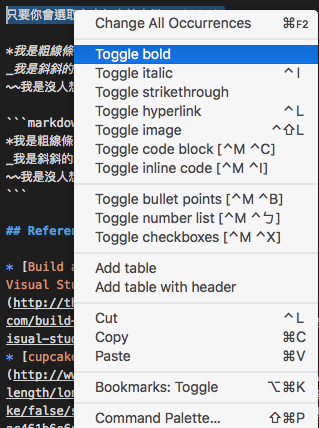

# Easy Markdown with VS Code

[udemy - Easy Markdown with VS Code](https://www.udemy.com/easy-markdown-with-vs-code/learn/v4/overview)

## VS Code extension

* GFM Preview
* Markdown Shortcuts
* Markdown PasteURL
* markdownlint
* markdown-emoji



## VS Code Setting

* gfmpreview.githubUsername
* gfmpreview.githubPassword

## Formatting Markdown

### 標題（Heading）

```markdown
# This is level1 heading
## This is level2 heading
### This is level3 heading
#### This is level4 heading
##### This is level5 heading
###### This is level6 heading
```

### 換行（Line Break）

* 兩個空白 ＋ {enter}
* 兩個 {enter}

Cupcake ipsum dolor sit amet pudding caramels sugar plum.  
Tootsie roll cookie toffee halvah jelly gummi bears chocolate bar caramels. Pudding jelly beans powder. Bonbon caramels cake.

### 文字格式（Text Formatting）

只要你會選取文字加上按右鍵，VS Code可以讓你很輕鬆地作轉換



*我是粗線條的粗體字*  
_我是斜斜的斜體字_  
~~我是沒人想看的刪除字~~

```markdown
*我是粗線條的粗體字*
_我是斜斜的斜體字_
~~我是沒人想看的刪除字~~
```

## 製作清單（Making List）

在開頭使用空白來做縮排

1. 子彈清單（bullet list）
1. 數字清單（number list）
1. 選項清單（checkbox-ish list）

* Cupcake ipsum dolor sit amet soufflé caramels chupa chups gingerbread. Jelly beans sweet sugar plum.
* Chocolate bar chocolate bar lemon drops halvah chocolate chupa chups.
* Muffin jelly-o cheesecake marshmallow gummies halvah.
    1. Powder chocolate bar donut. Tootsie roll sweet roll ice cream marshmallow cake chupa chups cupcake sweet.
    1. Bear claw cake marzipan halvah oat cake cookie marzipan fruitcake.
    1. Topping powder jelly sugar plum jujubes donut brownie.
* Toffee brownie biscuit biscuit.

* [ ] Chocolate cake topping tootsie roll sesame snaps cupcake cotton candy macaroon sweet.
* [ ] Candy canes gummies gummies cake.

## 圖片與連結（Pictures & Links）

1. 單純的連結： `<link url>`
1. 文字加連結： `[link text](link url "tooltip")`
1. 圖片＋連結： `[ "tooltip"][link url]`

<https://github.com>

[Web Coders Facebook Group](https://www.facebook.com/InternetCoders/?fref=ts)

[Ice Cream Ipsum](http://joeyfoo.github.io/icecream-ipsum/ "Go to Ice Cream Ipsum")


Here's [github profile][linked] page

[](https://github.com/vincentliu99999)

[linked]: https://github.com/vincentliu99999

### 影片（Video in Markdown）

<!-- YouTube video link -->
[](http://www.youtube.com/watch?v=E0ao2tT410M "Watch Video")

## 表格（Table）

* 右鍵 －＞ Add table
* 右鍵 －＞ Add table with header
* 從 excel 或 google sheet 複製＋貼上 －＞ 右鍵 －＞ Add table 或 Add table with header

Column A | Column B | Column C | Column D
---------|----------|---------|---------
 A1 | B1 | C1 | D1
 A2 | B2 | C2 | D2
 A3 | B3 | C3 | D3

## 程式碼（Sharing Code）

* inline code
* code block

```html
<h1>Hello Markdown<h1>
<p>Roses are red<br>
```

Don't `alert()` to much.

## 表情符號（emojis）

* 語法： `:emoji_name:`
* [Github Emojis](https://gist.github.com/rxaviers/7360908): 預設的預覽是不會有表情符號的，一定要用GFM，但是安裝Extension(markdown-emoji)就可以使用了

:heart_eyes:
:kissing_closed_eyes::kissing_closed_eyes:

:kissing_closed_eyes:

## Reference

* [Build an Amazing Markdown Editor Using Visual Studio Code and Pandoc](http://thisdavej.com/build-an-amazing-markdown-editor-using-visual-studio-code-and-pandoc/)
* [cupcakeipsum](http://www.cupcakeipsum.com/#/paragraphs/5/length/long/with_love/false/start_with_cupcake/false/seed/e608ca6c845fc246154359ca8267e6ac461b6e6ac1bbd877e7a9d7dac3b6319a)
* google 關鍵字
    * markdown cheatsheet
    * markdown reference guide
    * free markdown e-book
    * what apps support markdown